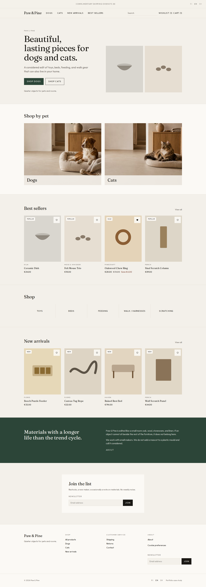
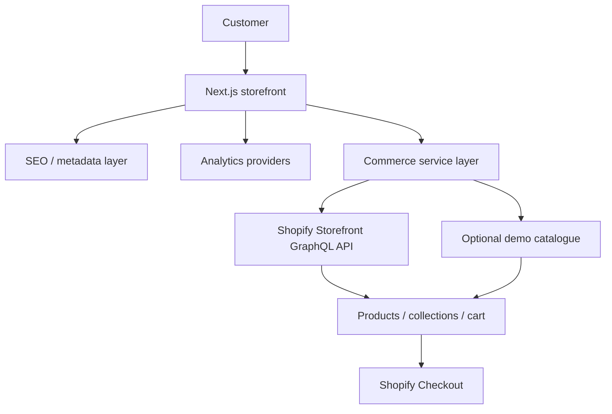

# Paw & Pine Commerce

A production-oriented headless Shopify ecommerce portfolio built with Next.js and TypeScript.

**Portfolio architecture: approximately €0 operating cost.**

A live commercial shop would require a **paid Shopify plan** and potentially paid carrier, email, and ads integrations. This public demo does not.

## Live demo

[paw-pine-commerce.vercel.app](https://paw-pine-commerce.vercel.app/)

## Screenshot



Mobile and tablet: [home-375](docs/screenshots/home-375.png) · [home-768](docs/screenshots/home-768.png) · more in [docs/screenshots](docs/screenshots/)

## Editorial imagery

Selected editorial lifestyle imagery in this portfolio project is AI-generated or AI-assisted. These visuals are used for brand presentation only. Product catalogue data and ecommerce functionality are implemented through the project’s Shopify-based commerce architecture.

The same note is on the in-app [case study](docs/case-study.md) and `/case-study` (FI / EN / SV). It is not shown on homepage category cards, product cards, collections, cart, checkout, or the cookie banner.

## Tech stack

Next.js 16 (App Router) · TypeScript · Tailwind CSS v4 · Shopify Storefront GraphQL · Vitest · Playwright · GitHub Actions · Vercel Hobby

## Key features

- Real Shopify Storefront GraphQL API
- Real Shopify product catalogue
- Shopify cart and checkout
- Custom Next.js storefront
- Technical SEO
- Typed ecommerce analytics
- GDPR-aware analytics consent
- Conversion funnel demo
- Google Shopping feed generation
- Wishlist
- Recently viewed
- Rule-based recommendations
- Finnish delivery integration architecture
- FI / EN / SV localization
- Automated Playwright tests
- CI/CD
- Core Web Vitals optimization

Finnish delivery is a **provider adapter** with a **mock integration** (`MockShippingProvider`). It is not a live Posti or Matkahuolto connection. The shopping feed is generated in this app; it is not submitted to Google Merchant Center. Analytics are GTM-ready; they are not a production GA4 property unless you connect one.

Hiring notes: [case study](docs/case-study.md) · [requirement matrix](docs/job-requirement-matrix.md) · [€0 cost audit](docs/free-tier-architecture.md) · [interview answers](docs/interview-notes.md)

## Architecture



Shopify owns catalogue, inventory, carts, and payment. Next.js owns the storefront, URLs, SEO, and measurement. The demo provider is used when Storefront credentials are absent so CI and hiring review still work.

Longer write-up: [docs/case-study.md](docs/case-study.md) · [docs/architecture.md](docs/architecture.md) · [docs/interview-notes.md](docs/interview-notes.md)

## Why not always choose headless?

A new, small ecommerce business should often start with a **conventional Shopify theme**. It is faster to launch, cheaper to maintain, and already includes checkout and apps.

This repository is headless because the brief is also to demonstrate storefront engineering: custom UI, API integration, performance, SEO, analytics, and tests. If the brief were “sell oak bowls next month with the smallest team,” a theme would be the honest recommendation.

## Local setup

Requires Node 20+ (22 in CI):

```bash
npm ci
npm run dev
```

Open [http://localhost:3000](http://localhost:3000) (redirects to `/fi`). English: [http://localhost:3000/en](http://localhost:3000/en). Swedish: [http://localhost:3000/sv](http://localhost:3000/sv). No Shopify account is required. FI | EN | SV in the header keeps the current product, collection, or query.

```bash
npm run lint
npm run typecheck
npm run test
npm run test:e2e
npm run build
```

## Seed the Dev Store (CLI, no Admin UI)

The Storefront token cannot create products. Seeding uses the **Admin API** and the existing demo catalogue.

Shopify no longer shows a copy-paste `shpat_…` token for Dev Dashboard apps. Use **Client ID + Client secret** instead.

1. In the [Dev Dashboard](https://dev.shopify.com/dashboard), create or open the seeder app (scopes: `read_products`, `write_products`, `read_publications`, `write_publications`). Leave **Use legacy install flow** off.
2. Install that app on the same-organization Dev Store.
3. **App settings** → copy **Client ID** and **Client secret** into `.env.local` as `SHOPIFY_CLIENT_ID` and `SHOPIFY_CLIENT_SECRET` (same `SHOPIFY_STORE_DOMAIN` as the storefront). Do not put these in `SHOPIFY_ADMIN_ACCESS_TOKEN`. Do not use the Headless Storefront token or the App automation token.
4. Run (from WSL; `make seed` copies onto the Linux filesystem so npm does not hang on `/mnt/d`):

```bash
make seed
make seed-archive
```

`npm run seed:shopify` works on a native Linux/macOS checkout. On WSL + `/mnt/d` it often hangs.

The second command archives Shopify’s sample snowboards and gift card. Redeploy, or wait about a minute for Storefront cache.

Do not put the Admin token in Vercel. It is only for this local seed script.

Copy `.env.example` to `.env.local` only if you connect a shop. Tokens stay on the server. Never commit `.env.local`. Never use `NEXT_PUBLIC_` for Shopify secrets.

| Variable                           | Required                  | Purpose                                                                                                                                                                                    |
| ---------------------------------- | ------------------------- | ------------------------------------------------------------------------------------------------------------------------------------------------------------------------------------------ |
| `NEXT_PUBLIC_SITE_URL`             | Production canonical URLs | Site origin                                                                                                                                                                                |
| `NEXT_PUBLIC_GTM_ID`               | No                        | Optional `GTM-…` container. Injected only after analytics consent.                                                                                                                         |
| `NEXT_PUBLIC_ANALYTICS_DEBUG`      | No                        | Console-log analytics events (still after consent)                                                                                                                                         |
| `SHOPIFY_STORE_DOMAIN`             | Live catalogue            | `your-store.myshopify.com`                                                                                                                                                                 |
| `SHOPIFY_STOREFRONT_PRIVATE_TOKEN` | Live catalogue            | Headless **private access token** (server only). Not the Admin API token.                                                                                                                  |
| `SHOPIFY_STOREFRONT_API_VERSION`   | No                        | Defaults to `2026-07`                                                                                                                                                                      |
| `SHOPIFY_STOREFRONT_PASSWORD`      | Dev Store checkout        | Online Store password from **Preferences**. Copied at Kassalle so shoppers can paste it on Shopify’s `/password` page. Development stores cannot turn that page off. Never `NEXT_PUBLIC_`. |

Shopify mode uses the Storefront GraphQL API at `/api/2026-07/graphql.json` for products, collections, search, and cart mutations. If those credentials are missing, the local demo catalogue is used. If they are present and Shopify fails, the shop shows an error — it does not swap in mock products.

On Vercel, set `SHOPIFY_STORE_DOMAIN` and `SHOPIFY_STOREFRONT_PRIVATE_TOKEN` for **Production** (build and runtime). Framework Preset must be **Next.js**. Leave **Output Directory** empty (do not set it to `public`).

**Which token:** in Shopify admin, **Sales channels → Headless → your storefront**. Copy **private access token**. That value is not an Admin API token and does not start with `shpat_` or `shpca_`. If you created a custom app, use its **Storefront API access token**, not **Admin API access token**. Never wrap the value in quotes. Never `NEXT_PUBLIC_`.

In Headless, **Edit** Storefront API permissions and enable products and collections. The sample ski/snowboard products on a new Dev Store are Shopify’s defaults, not Paw & Pine.

Expected Shopify tags when connecting a live shop: `species:dog|cat`, `category:toys|harnesses|beds|feeding|scratching`, `material:…`, optional `sku:`, `dimensions:`, `care:`, `feature:`.

**Checkout (Kassalle).** The button goes to `/checkout`, which validates `cart.checkoutUrl` and then opens Shopify-hosted checkout. A **development store cannot disable** Online Store password protection (Preferences only shows the password). Set `SHOPIFY_STOREFRONT_PASSWORD` in `.env.local` and Vercel to that Preferences password; Kassalle copies it so you can paste it on Shopify’s next screen. Do not commit the password. A paid/live shop without a storefront password does not need the variable.

## Analytics

No paid analytics platform is required for the portfolio demo.

The storefront emits a typed `EcommerceEvent` union (`page_view`, `view_item_list`, `select_item`, `view_item`, `search`, `add_to_cart`, `remove_from_cart`, `view_cart`, `begin_checkout`, `purchase`). UI code calls `track()` only. Providers push a GA4-shaped `dataLayer`, optionally log in development, and keep a session copy for `/demo/analytics`.

**Consent.** Necessary cookies (language, bag, the consent cookie) are always on. Analytics stay off until **Accept analytics**. **Necessary only** and **Cookie preferences** (footer) persist that choice in `paw_pine_consent`. `NEXT_PUBLIC_GTM_ID` is optional; the GTM snippet is injected only after analytics consent.

**Funnel.** Collection list → product select → product view → add to cart → cart → begin checkout. Shopify-hosted checkout is outside this app, so `purchase` is in the type system but is not fired from the Checkout button. A live shop would send it from the order status page or a webhook.

**Demo data.** `/demo/analytics` is labelled **DEMO DATA**. The large session / conversion / AOV numbers are an illustrative sample. They are not live traffic.

Longer write-up: [docs/analytics.md](docs/analytics.md).

## Localization

UI strings live in `locales/fi.json`, `locales/en.json`, and `locales/sv.json`. There is **no paid translation API**. Finnish is the default market (`/` → `/fi`). English and Swedish use `/en` and `/sv`. Shopify product copy is whatever Storefront `@inContext` returns; this repo does not invent live-catalogue translations. See [docs/i18n.md](docs/i18n.md).

## Technical SEO and product discovery

SSR metadata, canonicals, JSON-LD (no fake reviews), sitemap, and robots are documented in [docs/seo.md](docs/seo.md). `/api/feeds/google-shopping.xml` is a Merchant-shaped product feed generated from the live or demo catalogue. **The feed endpoint works without requiring a paid Google service or ad campaign.** It is not submitted to Merchant Center from this repository.

## Wishlist, recently viewed, and related products

These stay on the device or in the catalogue. There is no Customer Account API, recommendation service, or database.

- **Wishlist** — `localStorage`, `/wishlist`, header count. Empty until the client hydrates.
- **Recently viewed** — up to 8 handles, newest first, deduped, shown on product, cart, and wishlist pages.
- **Related products** — `getRelatedProducts(current, catalogue)` ranks by species, category, tags, collection membership, and price. Different species are excluded.

## Delivery, restock alerts, and newsletter

**Real:** Shopify catalogue, cart, and hosted checkout (when the shop is connected).

**Simulated:** cart delivery estimate (`MockShippingProvider`, Finnish postcode `^[0-9]{5}$`), back-in-stock form (`MockNotificationProvider`), footer newsletter (`MockNewsletterProvider`). No Posti, Matkahuolto, or email API is called. Rates are labelled demo; checkout still confirms shipping on Shopify.

**Future adapters (not in this repo):** `PostiShippingProvider`, `MatkahuoltoShippingProvider`, and a real ESP. See [docs/future-architecture.md](docs/future-architecture.md).

## Performance & Operations

The storefront is meant to stay on **free** hosting and logging. There is no paid APM, RUM, or synthetic monitor in this repository.

**Core Web Vitals.** Catalogue HTML comes from Server Components. LCP work is `next/image` (priority on the home hero and the first collection row, AVIF/WebP, reserved 4:5 frames). CLS risks are the consent banner (after hydrate) and font swap (`next/font` `display: swap`). INP risks are cart, filters, and GTM — GTM loads only after analytics consent. Production posts LCP, INP, CLS, FCP, and TTFB to `POST /api/vitals` (pathname only). **Do not treat those logs as a Lighthouse score.**

**GraphQL.** Listing queries request card fields only (no description, gallery, options, or variants). Detail queries add those fields. Queries cap at 50 products. Home uses one catalogue fetch. Product pages fetch the product and related ranking in parallel. Cart stays `no-store` and is not read in the root layout.

**Caching.** Catalogue `revalidate: 60` (search `30`). Cart `no-store`. Do not cache shopper-specific bags.

**Health.** `GET /api/health` returns `{ "status": "ok", "dependencies": { "shopify": "ok" | "error" | "not_configured" } }`. Demo is `not_configured` with HTTP 200. A configured shop is probed with a tiny `shop { id }` query and a 2.5s timeout; failures are HTTP 503. No secrets, env, tokens, or stack traces.

**Failure handling.** Shopify down in live mode shows an error, not the demo catalogue. Expired carts are cleared. Logs are Vercel stdout: `[storefront]`, `[health]`, `[cwv]`. Tokens and PII are never logged.

**Vercel.** Next.js preset, image optimisation on `cdn.shopify.com`, Hobby is enough. Optional later (not installed): Speed Insights, Sentry, a free uptime ping at `/api/health`.

Longer write-up: [docs/performance.md](docs/performance.md).

## Further reading

- [Case study](docs/case-study.md)
- [Job requirement matrix](docs/job-requirement-matrix.md)
- [Free-tier architecture](docs/free-tier-architecture.md)
- [Architecture and caching](docs/architecture.md)
- [Performance and operations](docs/performance.md)
- [Analytics events](docs/analytics.md)
- [Technical SEO and product discovery](docs/seo.md)
- [Localization (FI / EN / SV)](docs/i18n.md)
- [Security notes](docs/security.md)
- [Interview answers](docs/interview-notes.md)
- [Future: shipping adapters and AI search](docs/future-architecture.md)

## License

Private portfolio project. Product names and still-life artwork are original to this repository; do not use copyrighted brand assets when you connect a live shop.
