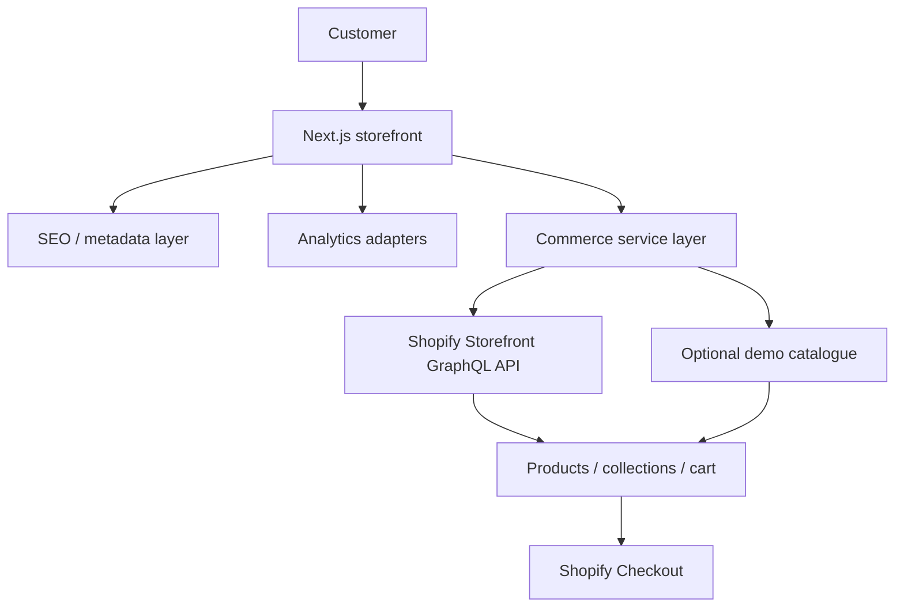

# Paw & Pine

Headless Shopify storefront for a small Scandinavian pet accessories house — built to be reviewed without a Shopify account.

**Live demo:** [paw-pine-commerce.vercel.app](https://paw-pine-commerce.vercel.app/)


Mobile and tablet: [home-375](docs/screenshots/home-375.png) · [home-768](docs/screenshots/home-768.png) · more in [docs/screenshots](docs/screenshots/)

**Stack:** Next.js 16 (App Router) · TypeScript · Tailwind CSS v4 · Shopify Storefront GraphQL · Vitest · Playwright

**What it does:** product discovery, product pages, cart, Shopify checkout boundary, technical SEO, typed ecommerce analytics, demo catalogue when credentials are missing.

## Highlights

- Headless Shopify architecture with a single commerce provider switch
- Responsive collections, search, and product pages
- Shopify cart + hosted checkout (validated HTTPS Shopify URLs)
- Typed ecommerce analytics with a pluggable adapter layer
- Technical SEO and JSON-LD (no fabricated ratings)
- Accessible UI (keyboard, dialogs, 44px targets, reduced motion)
- Playwright purchase-flow tests in demo mode
- Demo mode requiring no Shopify account

## Architecture



Shopify owns catalogue, inventory, carts, and payment. Next.js owns the storefront, URLs, SEO, and measurement. The demo provider is used when Storefront credentials are absent so CI and hiring review still work.

Longer write-up: [docs/case-study.md](docs/case-study.md) · [docs/architecture.md](docs/architecture.md) · [docs/interview-notes.md](docs/interview-notes.md)

## Why not always choose headless?

A new, small ecommerce business should often start with a **conventional Shopify theme**. It is faster to launch, cheaper to maintain, and already includes checkout and apps.

This repository is headless because the brief is also to demonstrate storefront engineering: custom UI, API integration, performance, SEO, analytics, and tests. If the brief were “sell oak bowls next month with the smallest team,” a theme would be the honest recommendation.

## Local setup

Requires Node 20+ (22 in CI):

```bash
npm ci
npm run dev
```

Open [http://localhost:3000](http://localhost:3000). No Shopify account is required.

```bash
npm run lint
npm run typecheck
npm run test
npm run test:e2e
npm run build
```

## Seed the Dev Store (CLI, no Admin UI)

The Storefront token cannot create products. Seeding uses the **Admin API** and the existing demo catalogue.

Shopify no longer shows a copy-paste `shpat_…` token for Dev Dashboard apps. Use **Client ID + Client secret** instead.

1. In the [Dev Dashboard](https://dev.shopify.com/dashboard), create or open the seeder app (scopes: `read_products`, `write_products`, `read_publications`, `write_publications`). Leave **Use legacy install flow** off.
2. Install that app on the same-organization Dev Store.
3. **App settings** → copy **Client ID** and **Client secret** into `.env.local` as `SHOPIFY_CLIENT_ID` and `SHOPIFY_CLIENT_SECRET` (same `SHOPIFY_STORE_DOMAIN` as the storefront). Do not put these in `SHOPIFY_ADMIN_ACCESS_TOKEN`. Do not use the Headless Storefront token or the App automation token.
4. Run (from WSL; `make seed` copies onto the Linux filesystem so npm does not hang on `/mnt/d`):

```bash
make seed
make seed-archive
```

`npm run seed:shopify` works on a native Linux/macOS checkout. On WSL + `/mnt/d` it often hangs.

The second command archives Shopify’s sample snowboards and gift card. Redeploy, or wait about a minute for Storefront cache.

Do not put the Admin token in Vercel. It is only for this local seed script.

Copy `.env.example` to `.env.local` only if you connect a shop. Tokens stay on the server. Never commit `.env.local`. Never use `NEXT_PUBLIC_` for Shopify secrets.

| Variable | Required | Purpose |
| --- | --- | --- |
| `NEXT_PUBLIC_SITE_URL` | Production canonical URLs | Site origin |
| `NEXT_PUBLIC_GTM_ID` | No | Optional `GTM-…` container |
| `NEXT_PUBLIC_ANALYTICS_DEBUG` | No | Console-log analytics events |
| `SHOPIFY_STORE_DOMAIN` | Live catalogue | `your-store.myshopify.com` |
| `SHOPIFY_STOREFRONT_PRIVATE_TOKEN` | Live catalogue | Headless **private access token** (server only). Not the Admin API token. |
| `SHOPIFY_STOREFRONT_API_VERSION` | No | Defaults to `2026-07` |

Shopify mode uses the Storefront GraphQL API at `/api/2026-07/graphql.json` for products, collections, search, and cart mutations. If those credentials are missing, the local demo catalogue is used. If they are present and Shopify fails, the shop shows an error — it does not swap in mock products.

On Vercel, set `SHOPIFY_STORE_DOMAIN` and `SHOPIFY_STOREFRONT_PRIVATE_TOKEN` for **Production** (build and runtime). Framework Preset must be **Next.js**. Leave **Output Directory** empty (do not set it to `public`).

**Which token:** in Shopify admin, **Sales channels → Headless → your storefront**. Copy **private access token**. That value is not an Admin API token and does not start with `shpat_` or `shpca_`. If you created a custom app, use its **Storefront API access token**, not **Admin API access token**. Never wrap the value in quotes. Never `NEXT_PUBLIC_`.

In Headless, **Edit** Storefront API permissions and enable products and collections. The sample ski/snowboard products on a new Dev Store are Shopify’s defaults, not Paw & Pine.

Expected Shopify tags when connecting a live shop: `species:dog|cat`, `category:toys|harnesses|beds|feeding|scratching`, `material:…`, optional `sku:`, `dimensions:`, `care:`, `feature:`.

## Further reading

- [Case study](docs/case-study.md)
- [Architecture and caching](docs/architecture.md)
- [Analytics events](docs/analytics.md)
- [Security notes](docs/security.md)
- [Interview answers](docs/interview-notes.md)
- [Future: shipping adapters and AI search](docs/future-architecture.md)

## License

Private portfolio project. Product names and still-life artwork are original to this repository; do not use copyrighted brand assets when you connect a live shop.
